CUDA Rasterizer
===============

[CLICK ME FOR INSTRUCTION OF THIS PROJECT](./INSTRUCTION.md)

**University of Pennsylvania, CIS 565: GPU Programming and Architecture, Project 3**

* LINSHEN XIAO
* Tested on: Windows 10, Intel(R) Core(TM) i7-6700HQ CPU @ 2.60GHz, 16.0GB, NVIDIA GeForce GTX 970M (Personal computer)

## Overview

In this project, I implemented a CUDA-based path tracer capable of rendering globally-illuminated images very quickly. Path tracing is a computer graphics Monte Carlo method of rendering images of three-dimensional scenes such that the global illumination is faithful to reality (reference: https://en.wikipedia.org/wiki/Path_tracing). Basially, for every pixel of the image, we shoot a ray from the camera, find an intersection, and return a color based on the material, position of the objects & lightsource and so on after a few depths. As this process for every pixel is relatively similar, we can use GPU to run the programs simultaneously to make the path tracer faster.

## Features

* Basic Lambert and Blinn shading
* Line rasterization mode
* Point rasterization mode
* Backface culling
* UV texture mapping with bilinear texture filtering and perspective correct texture coordinates

## Results

Rotating Duck
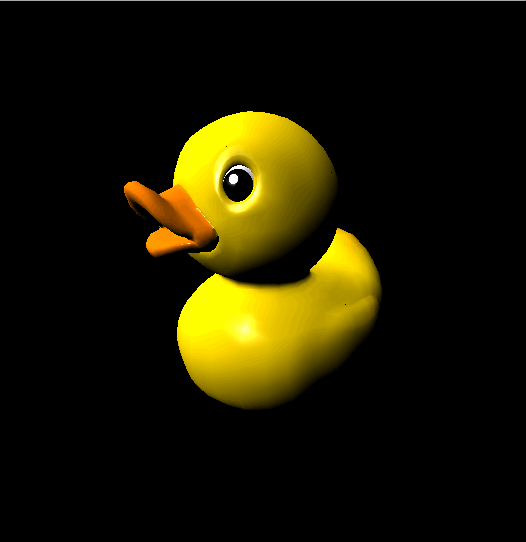

### Basic Lambert and Blinn shading
|Duck with texture and point light|Duck with Blinn-Phong|Duck with Blinn-Phong & Ambient light|
|------|------|------|
|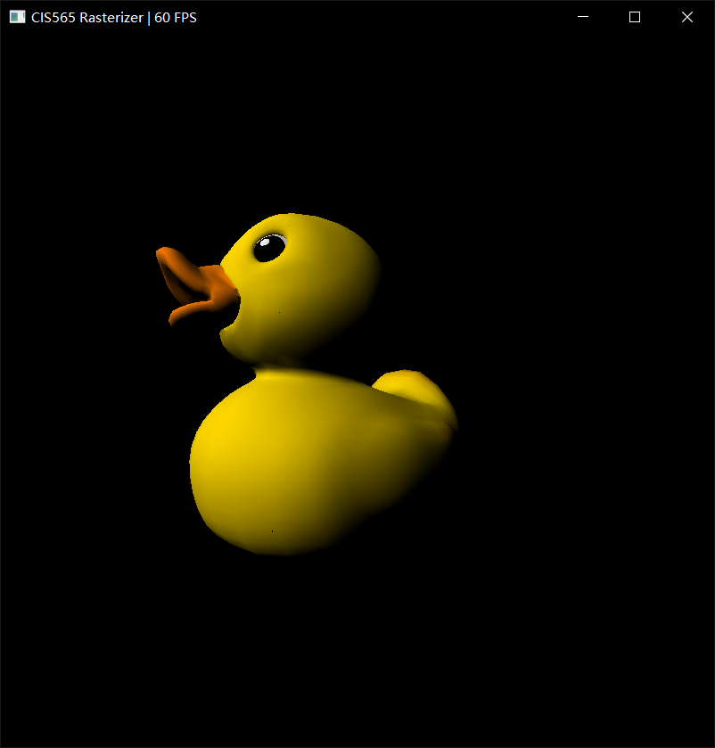 | 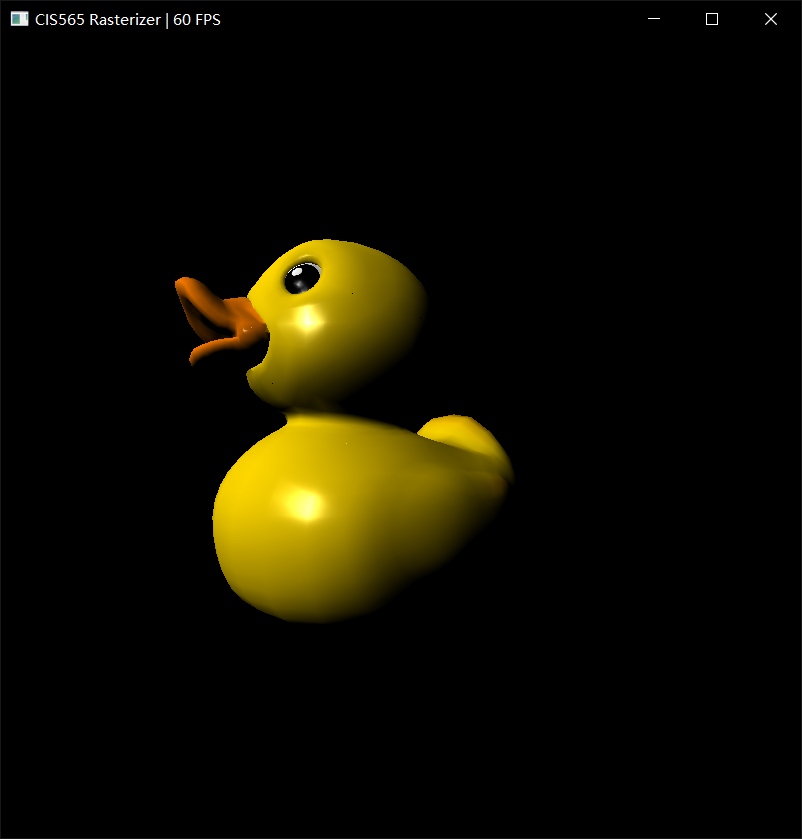 |  |

### Basic Normal and depth shading
|Duck with texture as color|Duck with normal as color|Duck with depth as color|
|------|------|------|
| | 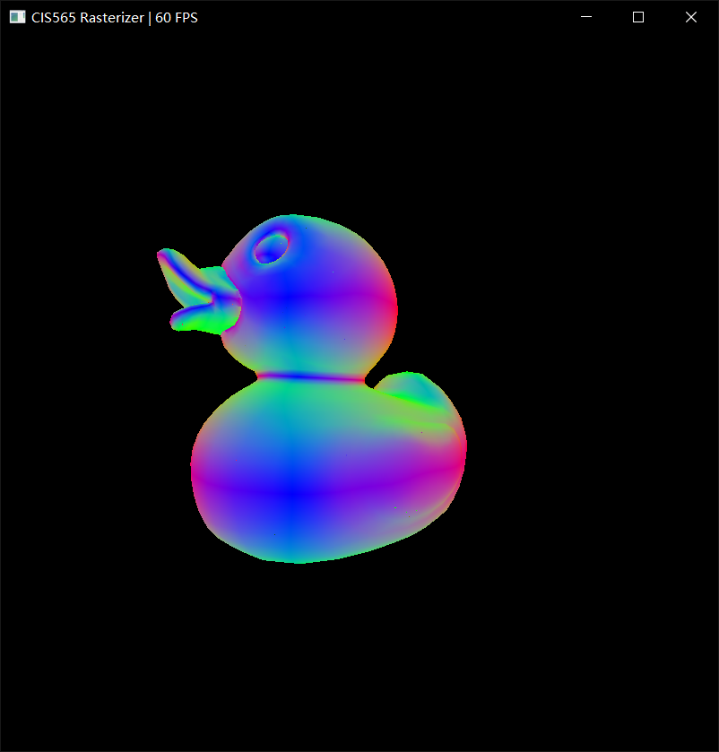 | 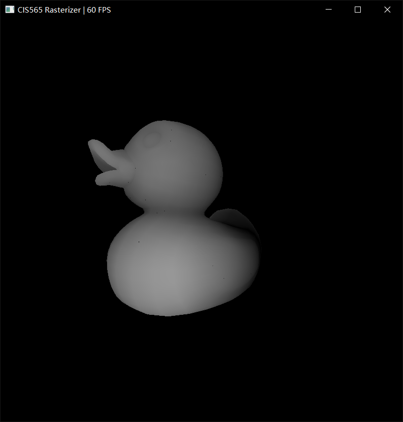 |

### Line and point rasterization
|Duck rasterized with triangles|Duck rasterized with lines|Duck rasterized with dots|
|------|------|------|
| | 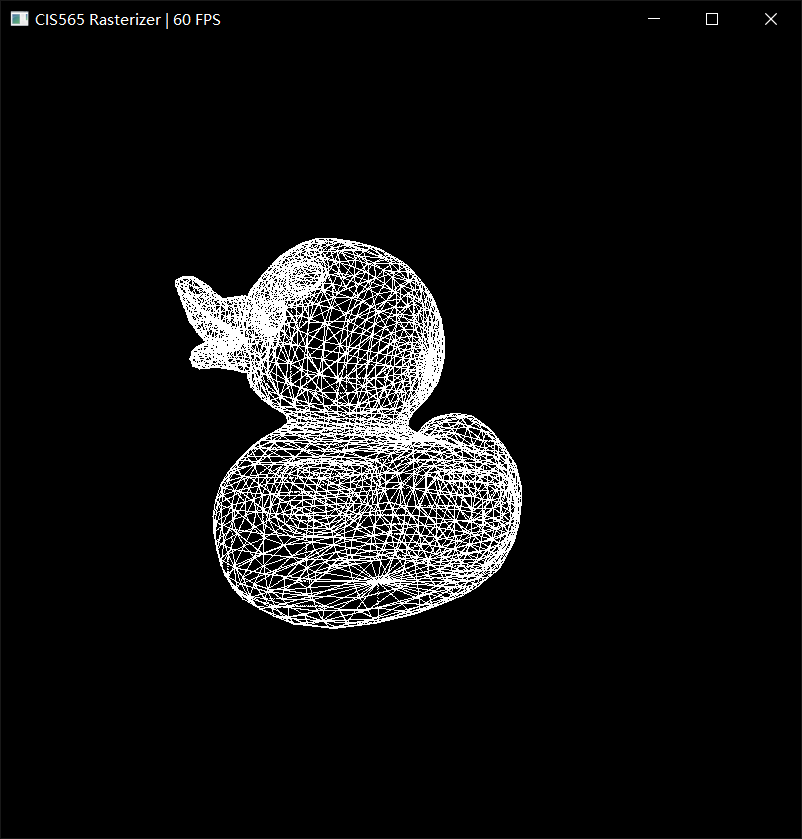 | 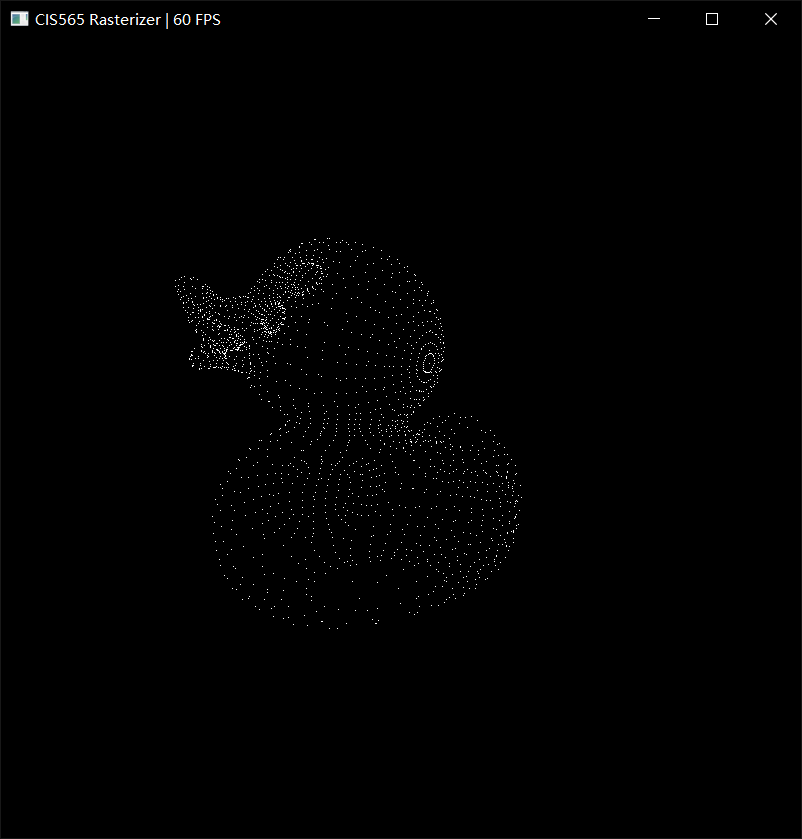 |

### Backface culling
|Duck rasterized with front faces|Duck rasterized with back faces|
|------|------|
| | 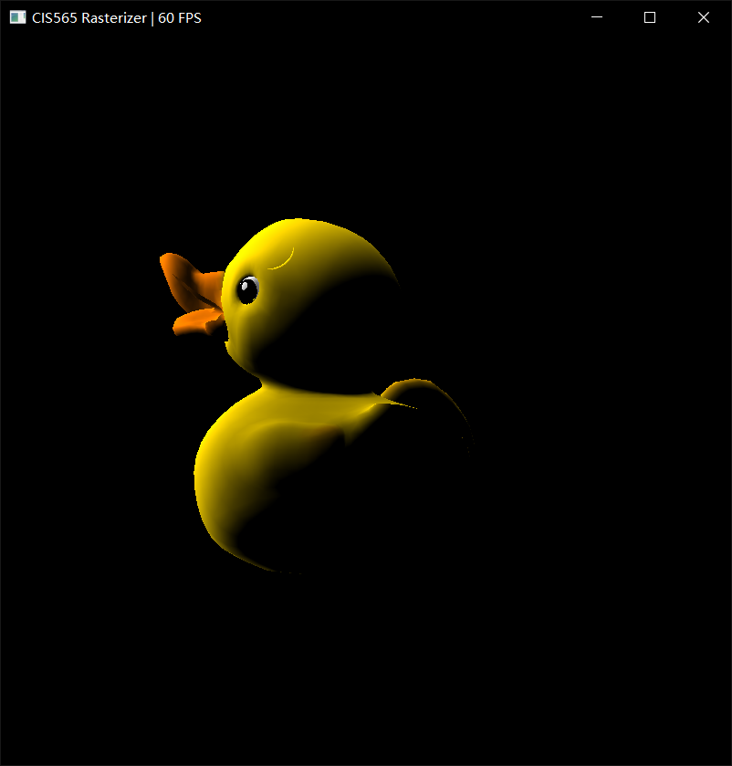 |

###UV texture mapping with bilinear texture filtering and perspective correct texture coordinates
|Original Checkerboard|Checkerboard with perspective correct texture coordinates|Checkerboard with bilinear texture filtering and perspective correct texture coordinates|
|------|------|------|
|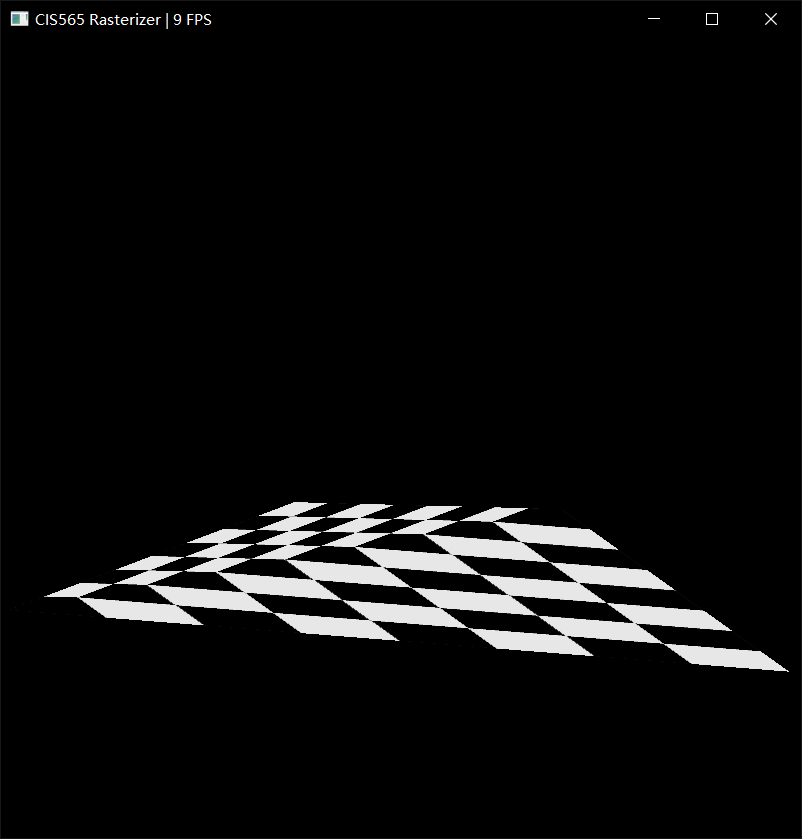 |  | 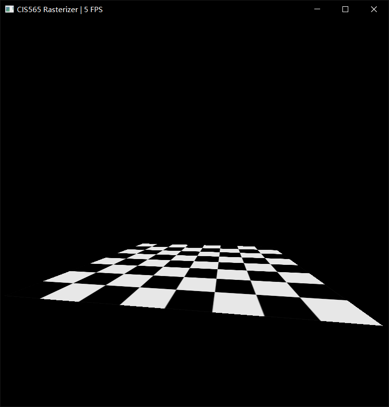 |

## Performance Analysis

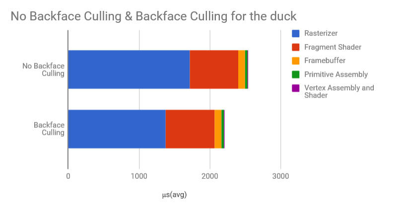

We can see that backface culling did save time in rasterizer part because it can ingnore the triangle than can not be seen.

### Credits

* [tinygltfloader](https://github.com/syoyo/tinygltfloader) by [@soyoyo](https://github.com/syoyo)
* [glTF Sample Models](https://github.com/KhronosGroup/glTF/blob/master/sampleModels/README.md)
