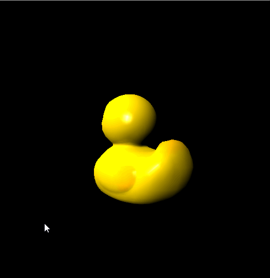
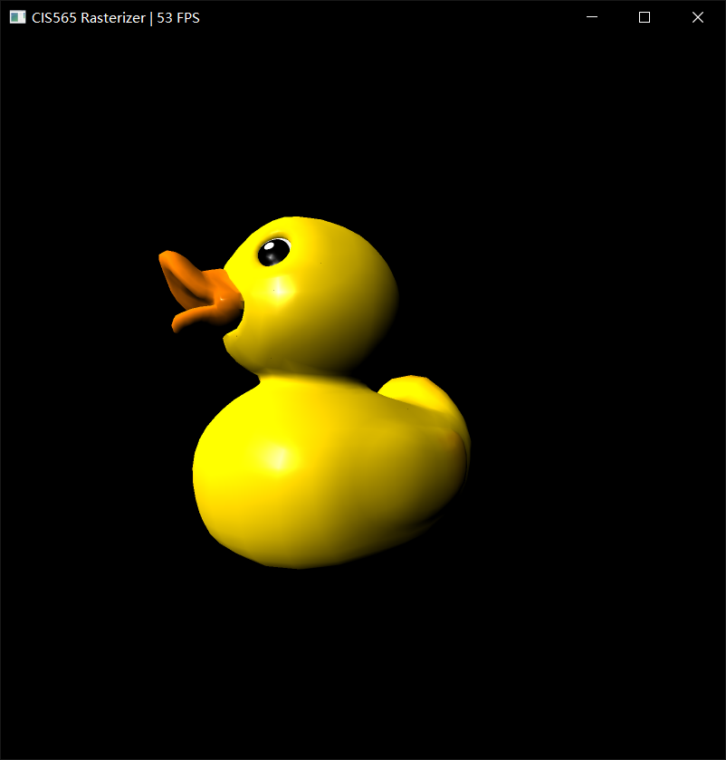
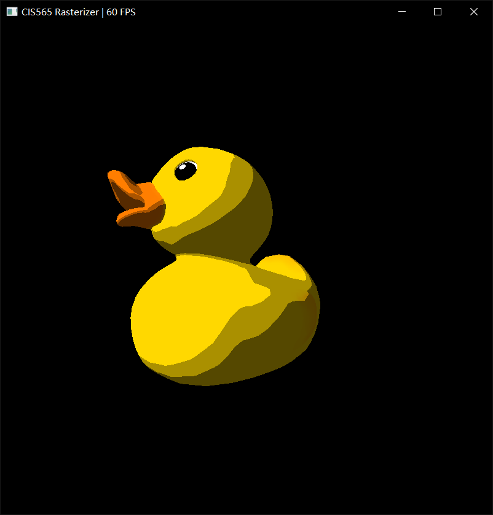
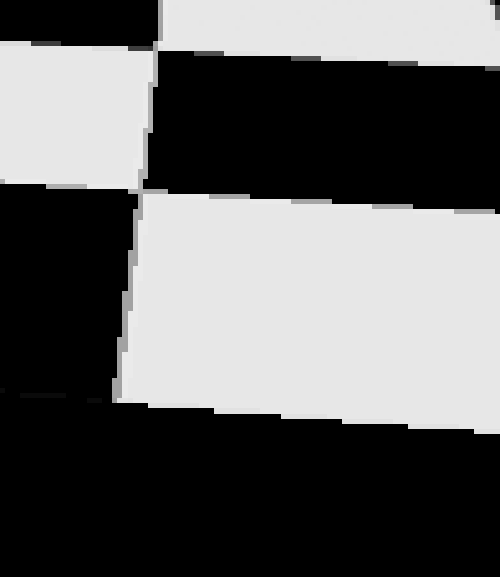
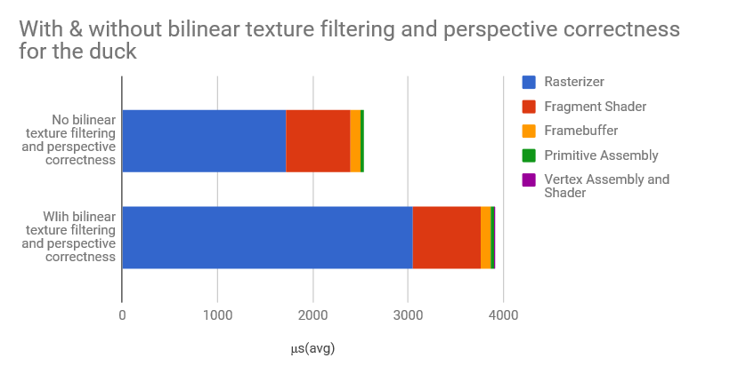

CUDA Rasterizer
===============

[CLICK ME FOR INSTRUCTION OF THIS PROJECT](./INSTRUCTION.md)

**University of Pennsylvania, CIS 565: GPU Programming and Architecture, Project 4**

* LINSHEN XIAO
* Tested on: Windows 10, Intel(R) Core(TM) i7-6700HQ CPU @ 2.60GHz, 16.0GB, NVIDIA GeForce GTX 970M (Personal computer)

## Overview

In this project, I used CUDA to implement a simplified rasterized graphics pipeline, similar to the OpenGL pipeline. I have implemented vertex shading, primitive assembly, rasterization, fragment shading, and a framebuffer.

## Features

* Basic Lambert and Blinn-Phong
* Line & Point rasterization
* Backface culling
* SSAA
* Other render style(painted style)
* Bilinear texture filtering
* Perspective correct texture coordinates

## Results

### Rotating Duck

### Basic Lambert and Blinn shading

|Duck with texture and point light|+Blinn-Phong|+Ambient light|
|------|------|------|
| |  |  |

### Basic Normal and depth shading

|Duck with texture as color|Duck with normal as color|Duck with depth as color|
|------|------|------|
| |  |  |

### Line and point rasterization

|Duck rasterized with triangles|Duck rasterized with lines|Duck rasterized with dots|
|------|------|------|
| |  |  |

### Backface culling

|Duck rasterized with front faces|Duck rasterized with back faces|
|------|------|
| |  |

### SSAA
|No SSAA|SSAA*2|SSAA*4|
|------|------|------|
| |  |  |

Let's have a closer look:

|No SSAA|SSAA*2|SSAA*4|
|------|------|------|
| |  |  |

### Painted style render

|Original Duck|"Painted style" Duck|

|------|------|
| |  |

### UV texture mapping with bilinear texture filtering and perspective correct texture coordinates

|Original Checkerboard|+Perspective correct texture coordinates|+Bilinear texture filtering|
|------|------|------|
|  |  |  |

Let's have a closer look:

|No Bilinear texture filtering|+Bilinear texture filtering|+SSAA*2|
|------|------|------|
|  |  |  |

## Performance Analysis

| Pipeline                   | No Backface Culling | Backface Culling |
|----------------------------|---------------------|------------------|
| Rasterizer                 | 1716.314            | 1375.803         |
| Fragment Shader            | 681.287             | 688.537          |
| Framebuffer                | 103.308             | 103.252          |
| Primitive Assembly         | 28.59               | 28.632           |
| Vertex Assembly and Shader | 11.014              | 11.004           |

Here we take the duck scene as an example. We can clearly see that rasterizer use most of the time, as there are lots of computation in this process, to check if the pixel of the bounding box lies inside the triangle, depth test and compute the interpolated texture coordinates and normal and so on. The render function in fragment shader also has some amount of computation for the computation for the color decided by normal, light direction and texture color.

We can see that backface culling did save time in rasterizer part. As the backface triangles are ingnored in the process, the performance did improved a bit.

| Pipeline                   | No bilinear texture filtering and perspective correctness  | With bilinear texture filtering and perspective correctness  |
|----------------------------|---------------------|------------------|
| Rasterizer                 | 1716.314            | 3049.726         |
| Fragment Shader            | 681.287             | 717.102          |
| Framebuffer                | 103.308             | 105.129          |
| Primitive Assembly         | 28.59               | 28.857           |
| Vertex Assembly and Shader | 11.014              | 11.101           |

We can see that bilinear texture filtering and perspective correctness did take more time in rasterizer and fragment shader part, for the computation of perspective correct texture coordinates and averanging texture color for bilinear texture filtering did take more time than the orginal method.

### Credits

* [tinygltfloader](https://github.com/syoyo/tinygltfloader) by [@soyoyo](https://github.com/syoyo)
* [glTF Sample Models](https://github.com/KhronosGroup/glTF/blob/master/sampleModels/README.md)
* [Line drawing](https://github.com/ssloy/tinyrenderer/wiki/Lesson-1:-Bresenham%E2%80%99s-Line-Drawing-Algorithm)
* [Backface culling](https://www.scratchapixel.com/lessons/3d-basic-rendering/ray-tracing-rendering-a-triangle/single-vs-double-sided-triangle-backface-culling)
